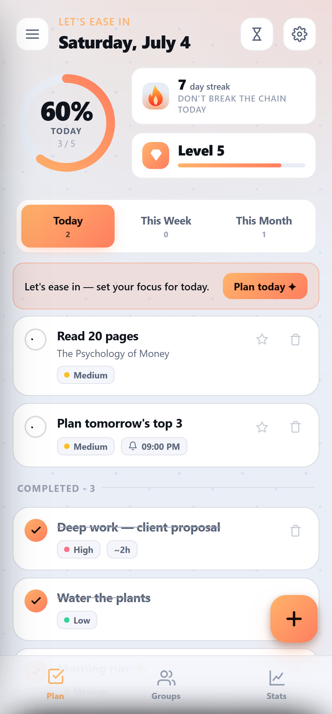
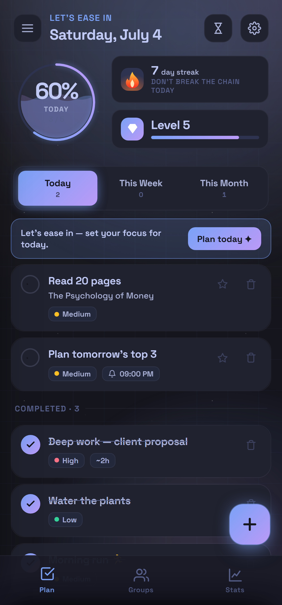
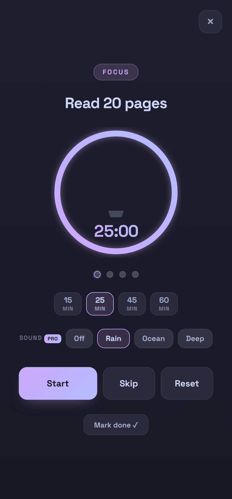
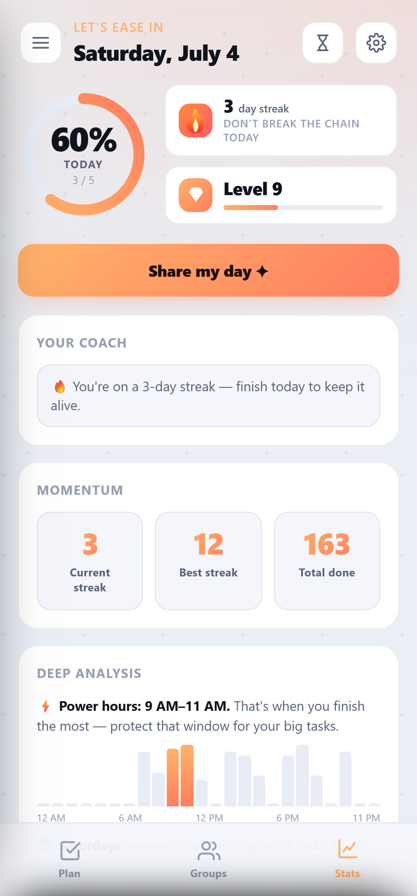
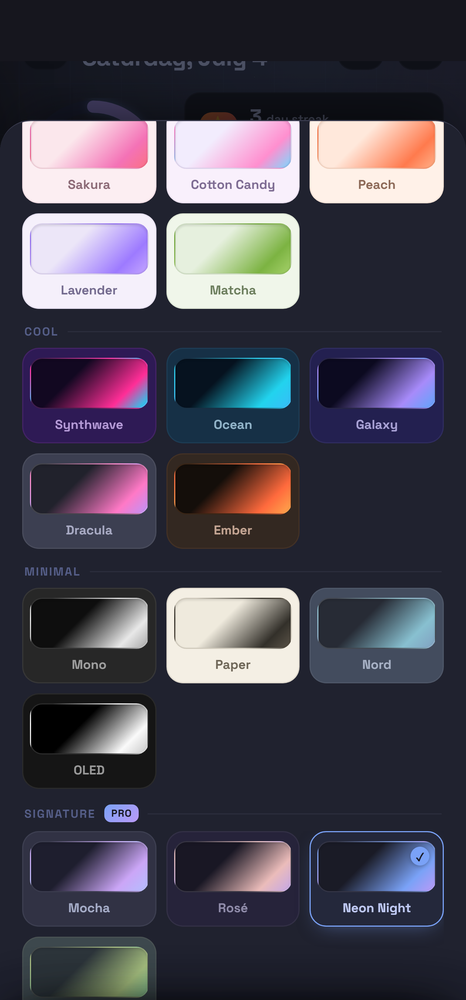
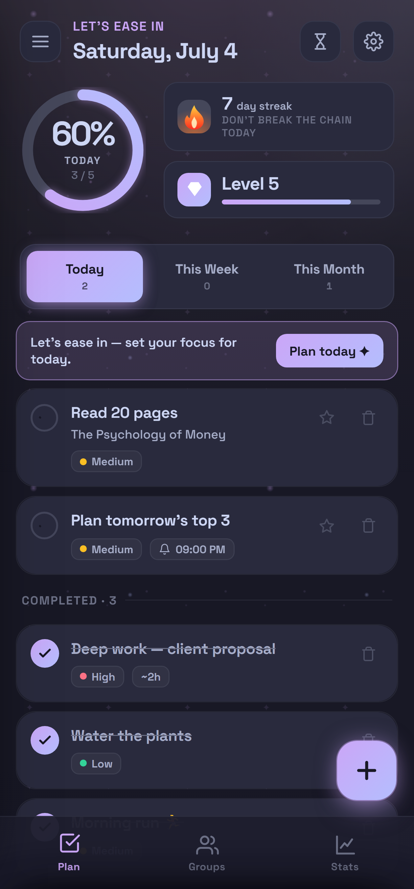

# Cadence — the planner you'll actually come back to

A beautiful, mobile-first daily / weekly / monthly planner built to be *genuinely fun to use*. Check tasks off with a satisfying burst, build streaks, earn levels, run deep-focus sessions, and plan together in groups — all stored **privately on your device**. No account. No tracking. No server.

|  |  |  |
|:---:|:---:|:---:|
|  |  |  |
|  |  |  |

---

## ✨ Highlights

- **Three scopes** — *Today*, *This Week*, *This Month*, each with its own progress ring.
- **Tasks that fit how you actually plan** — one-off to-dos *or* repeating habits. Daily habits reset each morning and **build your streak**; unfinished one-offs roll over.
- **Natural-language quick add** — type *"gym every mon 6pm"* and Cadence fills in the repeat, day and reminder for you.
- **The satisfying check-off** — an animated checkbox, confetti, a soft chime, a haptic tick, and a floating `+10 XP`.
- **Momentum, gamified** — day streaks 🔥, XP & levels, a contribution heatmap, and unlockable achievements.
- **Focus mode** — a pomodoro that survives the app being closed, with session dots, duration presets, and *Mark done* wired straight to your task list.
- **Stats & Deep Analysis** — your coach line, momentum cards, power hours, strongest weekday, month-over-month trends.
- **Reminders that actually ring** — pick a time when adding a task; the Android app notifies you **even when it's closed**, and includes a one-tap *"Test with app closed"* check plus a guide for phones with aggressive battery savers.
- **16 free themes**, dark & light, full **offline support**, and **backup / restore** so your data is always yours.
- Respects reduced-motion settings and is keyboard-accessible.

## ✦ Cadence Pro — one payment, yours forever

Everything above is free, forever. **Pro (₹199, one time — no account, no subscription)** unlocks the indulgent layer:

- **Custom theme creator** — your own accent colours, hex-precise, with saved palettes.
- **Signature theme packs** — Mocha, Rosé, Neon Night, Everforest.
- **Living backgrounds** — aurora, mesh, fireflies, nebula, drifting behind your day.
- **Signature celebrations** — fireworks, petals, stars, hearts, sparkles.
- **Liquid progress ring** — your day fills like water.
- **Focus plant & soundscapes** — grow a plant across each focus session to gentle rain, ocean or deep noise.

Buy once inside the app and Pro unlocks automatically — it keeps working offline and survives reinstalls.

## 👥 Groups — shared task lists, no servers

Plan with family, a study circle, or a small team. Create a group, invite people with a code, assign tasks, and check them off together.

- **No sign-up.** Your group identity lives only on your device, protected by a passphrase.
- **Real roles** — admin, moderator, member — and actions are cryptographically verified, so permissions can't be faked.
- **Private by design.** Sync happens either by sharing codes directly or through optional end-to-end-encrypted sync — either way, nobody in the middle can read your tasks.
- **Recovery** — export an encrypted recovery file (or use auto-backup to your own cloud folder on Chrome/Edge) and restore on any device.

## 📲 Get it

- **Android** — download **Cadence.apk** from [Releases](../../releases) and install it. First run: allow notifications, then try *Settings → Reminders → "Test with app closed"*. If it doesn't ring, the built-in guide shows the two battery settings to flip on your phone.
- **iPhone / iPad** — open the hosted app in Safari and use **Share → Add to Home Screen**; it installs like a native app and works offline.
- **Any browser** — Cadence is a PWA: open it, install it, done.

## 💾 Your data

- Everything is stored on your device only — nothing is uploaded anywhere.
- **Settings → Export backup** saves a file you control; **Import backup** restores it on any device.
- **Settings → Erase everything** removes it all, instantly.

---

Made with care. Plan the day, keep the streak. 🔥
